# Gwana DB ERD

- 대상 DB: `gwana-local-db` (= 원복된 `social-login` + 카카오 로그인 리팩터링 적용본)
- 작성일: 2026-07-28

> ⚠️ 이 스키마에는 **물리적 외래키(FK) 제약이 하나도 없다.** 아래 관계선은 모두
> 컬럼명 규칙(`user_id`, `product_id`, `order_id` …)과 애플리케이션(MyBatis) 로직으로
> 맺어지는 **논리적 관계**다. 그래서 관계 컬럼들 사이에 **타입 불일치**가 존재한다(아래 주석 참고).

## ERD

```mermaid
erDiagram
    users ||--o{ social_account : "소셜계정 (1:N)"
    users ||--o| refresh_token  : "리프레시토큰 (1:1, user_id UNIQUE)"
    users ||--o{ cart           : "장바구니"
    users ||--o{ payment_info   : "결제정보"
    users ||--o{ payment_session: "결제세션"
    users ||--o{ orders         : "주문 (created_by)"

    product ||--o{ product_option       : "옵션"
    product ||--|| product_review_stats  : "리뷰통계 (1:1)"
    product ||--o{ cart                  : "담김"
    product ||--o{ order_items           : "주문항목"
    product ||--o{ review                : "리뷰 (*타입불일치)"
    product ||--o{ inquiry               : "문의 (*타입불일치)"
    product ||--o{ payment_session       : "세션항목 (*타입불일치)"

    cart ||--o{ cart_item : "항목"
    product_option ||--o{ cart_item   : "선택옵션 (*타입불일치)"
    product_option ||--o{ order_items : "선택옵션"

    orders ||--o{ order_items  : "주문항목"
    orders ||--o| payment_info : "결제정보"
    payment_info ||--o{ payment_session : "세션항목"

    inquiry ||--o{ inquiry : "답변 (self, upper_inquiry_id)"

    users {
        varchar(100) user_id PK
        varchar(100) customer_key
        varchar(50)  username
        varchar(255) password "NULL (소셜 전용시)"
        varchar(100) email UK "NULL 허용, 전역 UNIQUE"
        varchar(20)  phone
        enum         role "ADMIN / GENERAL"
    }

    social_account {
        varchar(100) social_account_id PK
        varchar(100) user_id FK
        varchar(50)  provider "kakao ..."
        bigint       provider_id "provider+provider_id UNIQUE"
        text         access_token "소셜 토큰(리팩터링 추가)"
        datetime     access_token_expires_at
    }

    refresh_token {
        varchar(100) refresh_token_id PK
        varchar(100) user_id UK "사용자당 1행"
        char(64)     token_hash "Refresh 원문 SHA-256"
        datetime     expires_at
    }

    cart {
        bigint      cart_id PK
        bigint      product_id FK
        varchar(50) user_id FK "user+product UNIQUE"
    }

    cart_item {
        bigint      cart_item_id PK
        bigint      cart_id FK
        varchar(50) product_option_id FK "*varchar vs option.bigint"
        int         quantity
    }

    product {
        bigint       product_id PK
        varchar(255) product_name
        varchar(100) category_id
        varchar(50)  category_name
        json         images
        json         infos
        int          price
        int          shipping_price
    }

    product_option {
        bigint      product_option_id PK
        bigint      product_id FK
        varchar(100) option_name
        int         option_price
        tinyint     is_required
        tinyint     is_quantity_adjustable
    }

    product_review_stats {
        bigint     product_id PK "product와 1:1"
        decimal    avg_rating
        int        review_count
    }

    review {
        bigint      review_id PK
        varchar(50) product_id FK "*varchar vs product.bigint"
        varchar(500) content
        json        review_images
        decimal     rating
    }

    inquiry {
        bigint      inquiry_id PK
        bigint      upper_inquiry_id FK "self (답변)"
        varchar(50) product_id FK "*varchar vs product.bigint, NULL 허용"
        varchar(200) title
        text        content
        char(1)     is_secret
        char(1)     is_answered
    }

    orders {
        varchar(100) order_id PK
        varchar(20)  order_status
        int          product_amount
        int          shipping_fee
        int          discount_amount
        int          total_amount
        varchar(50)  created_by "주문자 user_id"
        datetime     ordered_at
        datetime     paid_at
    }

    order_items {
        bigint      order_item_id PK
        varchar(100) order_id FK
        bigint      product_id FK
        bigint      product_option_id FK
        varchar(255) product_name "스냅샷"
        int         option_price "스냅샷"
        int         quantity
    }

    payment_info {
        varchar(50) session_id PK
        varchar(50) order_id FK "*varchar(50) vs orders.varchar(100)"
        varchar(50) user_id FK
        int         total_amount
        datetime    expires_at
    }

    payment_session {
        bigint      payment_session_id PK
        varchar(50) session_id FK "payment_info.session_id"
        varchar(50) product_id FK "*varchar vs product.bigint"
        varchar(50) user_id FK
        int         quantity
        datetime    expires_at
    }
```

## 관계 요약

| 부모 | 자식 | 연결 컬럼 | 카디널리티 | 비고 |
|------|------|-----------|-----------|------|
| users | social_account | user_id | 1:N | (provider, provider_id) UNIQUE |
| users | refresh_token | user_id | 1:1 | user_id UNIQUE |
| users | cart | user_id | 1:N | (user_id, product_id) UNIQUE |
| users | orders | created_by | 1:N | 전용 user_id 컬럼 없음, 감사컬럼으로 소유 표현 |
| users | payment_info / payment_session | user_id | 1:N | 결제 진행중 임시 데이터 |
| product | product_option | product_id | 1:N | |
| product | product_review_stats | product_id | 1:1 | 집계 캐시 |
| product | cart / order_items / review / inquiry / payment_session | product_id | 1:N | |
| cart | cart_item | cart_id | 1:N | |
| product_option | cart_item / order_items | product_option_id | 1:N | |
| orders | order_items | order_id | 1:N | order_items는 상품/옵션 값을 스냅샷 저장 |
| orders | payment_info | order_id | 1:1(진행중) | |
| payment_info | payment_session | session_id | 1:N | |
| inquiry | inquiry | upper_inquiry_id | 1:N | self-reference (문의 답변) |

## 주의: 관계 컬럼 타입 불일치 (`*` 표시)

물리 FK가 없어 아래처럼 부모/자식 컬럼 타입이 다르다. 조인 시 암묵적 형변환이 일어난다.

| 자식.컬럼 | 타입 | 부모.컬럼 | 타입 |
|-----------|------|-----------|------|
| review.product_id | varchar(50) | product.product_id | bigint |
| inquiry.product_id | varchar(50) | product.product_id | bigint |
| payment_session.product_id | varchar(50) | product.product_id | bigint |
| cart_item.product_option_id | varchar(50) | product_option.product_option_id | bigint |
| payment_info.order_id | varchar(50) | orders.order_id | varchar(100) |
